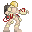

# Player    

This player is a scene with a basic collision shape, a camera, and a sprite (currently just a .png), all in 2D.
The camera has some smoothing and drag margin settings.

## Usage

Make sure these are assigned in `Project/Project Settings.../Input Map`

	A		"move_left"
	D		"move_right"
	Space		 "jump"

Drag `player.tscn` from the FileSystem explorer, onto a node to make it a child of that node. The parent node 
should be a `Node2D`, with a Tilemap child node that has collisions enabled (on the Tilemap inspector, enable
`Use Kinematic` in the `Collision` block.

By double clicking the `player.tscn` file, you can make changes to the player that will be updated wherever the
scene has been used. Changes will also update the live model in a DEBUG session (Run a game with F5).

To make changes to a local instance of the scene, click on the player instance which was created when you dragged
it into a node tree. You can then use the visual scene editor to update things like model size, rotation etc., but you 
will not have all the options in the inspector that you would have from editing the original `player.tscn`.

## Mechanics

The player has a **KinematicBody2D** collision object, currently with a rectangular **CollisionShape2D**. 

Code is run in `Player._physics_process(delat)` callback, which is called before each physics step at a constant
frame rate (60 times per second by default). The `delta` parameter is a floating-point number equal to the time 
passed in seconds since the last step.

Directional inputs are handled with `Input.get_action_strength("move_direction")`, which allows for variable input from
analog sticks.

Player can currently jump off walls, but the jump is the same as a jump from ground, direct upward force. This will be 
changed to take the force direction from user **Input**

## Issues

If you do not want the camera to be attached to the player, remove the Camera2D node from `player.tscn`.